# Esteira Inteligente de Release Notes — Apresentação

> **Workflow with Automation Assisted by Management** · Governança de deploy assistida por automação
> **Jira → Notion → Deploy (GCP)**, conduzida pelo orquestrador **"Optimus Prime"**.
>
> Documento visual de apresentação. **Comportamento canônico (fonte da verdade):** [`../spec/spec.md`](../spec/spec.md).
> Os diagramas abaixo estão em **Mermaid** (renderizam no GitHub, Notion, VS Code e PyCharm).

---

## 1. Sumário executivo

O deploy do *New Contract* já tinha automação parcial (`sync-repos-from-master`), mas o **passo
organizacional antes do deploy era frágil**: cards no Jira avançavam para deploy **sem as informações
mínimas**. A esteira fecha essa lacuna — **lê os cards prontos, valida por conteúdo, documenta a release
no Notion e prepara o deploy** — com **governança rastreável** e o **controle sempre com o time**
(*"a automação assiste, a gestão controla"*).

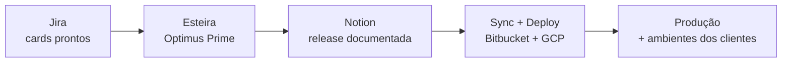

**Destaques**
- **MCP-first, código mínimo** — orquestra ferramentas oficiais (Atlassian, Notion) e o `make` do deploy.
- **Autônoma até o Notion**; deploy real e merges **sempre sob aprovação humana**.
- **Rastreável e idempotente** — cada execução registrada; nada silencioso.

---

## 2. O problema

Os 5 campos de deploy do card **não eram obrigatórios** — e um deles ("Ação de infra") nem existia. Sem
dados estruturados, o time de deploy trabalhava no escuro e a automação do passo seguinte era inviável.

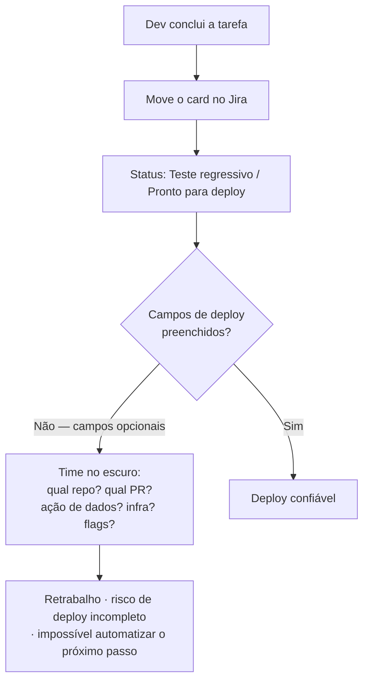

**Os 5 campos que todo card precisa:** Ação de dados · Link do repositório · Link da PR · Ação de infra
*(a criar)* · Flags.

---

## 3. Arquitetura em camadas

A esteira **não é um script que roda sozinho**: ela é um conjunto de instruções que ganham vida quando o
**Claude (o "cérebro")** está conectado e opera os **"braços"** (MCPs + `make`). Cada papel é uma *skill*.

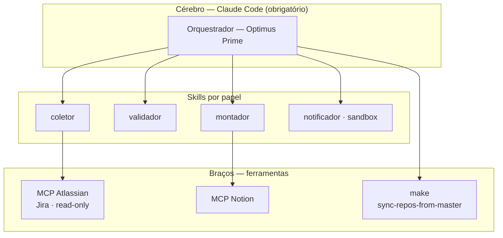

**Destaques**
- **Sem clients Python bespoke** — a orquestração é a skill sobre os MCPs (evita overengineering).
- **Privilégio mínimo**: Jira só leitura; Notion só a base de releases.
- Trocar de ferramenta **não muda o papel** — só a seção "Configuração atual" de cada skill.

---

## 4. Papéis da esteira

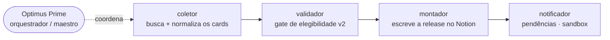

| Papel | Função | Estado |
|---|---|---|
| **coletor** | Busca cards no Jira (Atlassian MCP) e normaliza | Concluído |
| **validador** | Gate de elegibilidade por conteúdo (regra v2 + heurística) | Concluído |
| **montador** | Cria/atualiza a release/hotfix no Notion (molde padrão) | Concluído |
| **notificador** | Comunica pendências a dev/PO/QA | Em sandbox |
| **orquestrador** | Coordena tudo + governa o Sync; segurança por ação | Concluído · "Optimus Prime" |

---

## 5. Fluxo de execução (modelo atual)

No `iniciar`/`executar`, a esteira roda **autônoma até documentar a release no Notion** e **para antes do
Sync**. A **única pausa antes do Notion** é um **card genuinamente ambíguo**.

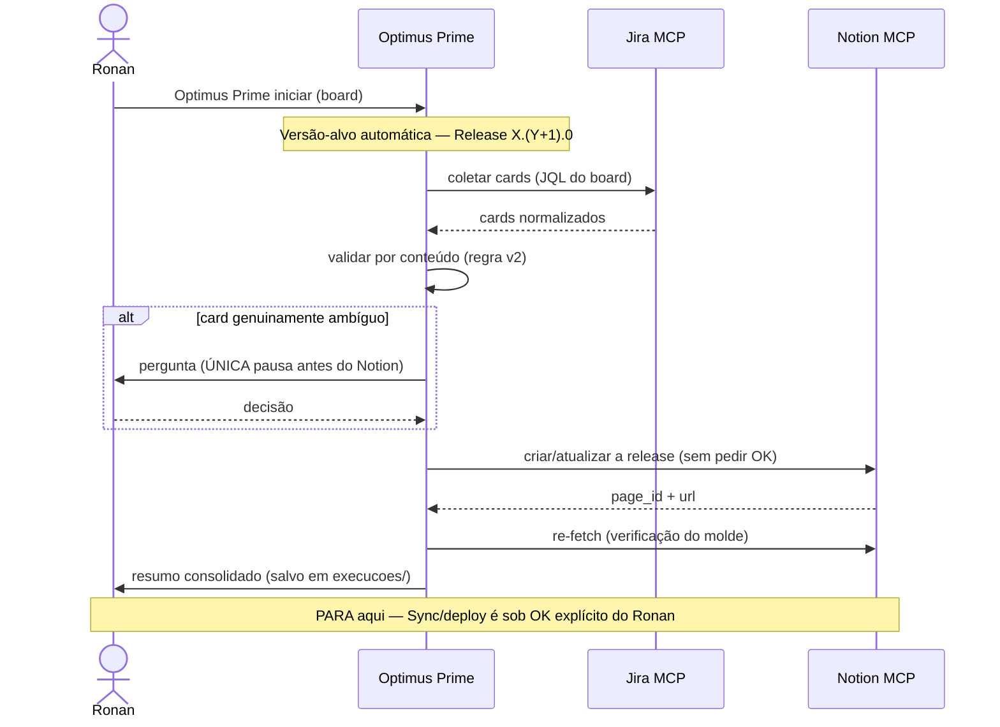

**Destaques**
- **Autonomia até o Notion** = velocidade sem perder rastreabilidade.
- **Incidente não é hotfix por padrão** — é Release comum; hotfix só quando o Ronan avisar.
- Após o Notion, **tudo é sob aprovação** (ver §8 e §9).

---

## 6. Varredura "todos os boards"

Um comando varre os três boards **em sequência, por prioridade**, **totalmente isolados** — cada board
gera **sua própria release e sua própria página no Notion**. **Nunca** se misturam cards de boards
diferentes.

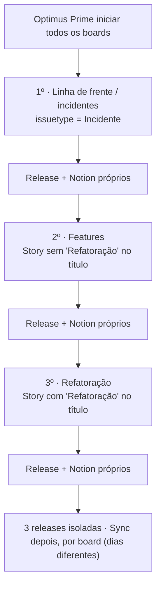

**Mapeamento dos boards** (visões dentro do projeto Jira `PB`; status alvo: `Teste regressivo` / `Pronto para deploy`):

| Prioridade | Board | Filtro (JQL) |
|---|---|---|
| 1º | **Linha de frente / incidentes** | `issuetype = Incidente` |
| 2º | **Features** | `issuetype = Story AND summary !~ "Refatoração"` |
| 3º | **Refatoração** | `issuetype = Story AND summary ~ "Refatoração"` |

---

## 7. Regra de elegibilidade v2

O **status não garante prontidão** — a validação é **por conteúdo**. Um card passa se tem **PR +
repositório** *ou* é **legitimamente só-banco**.

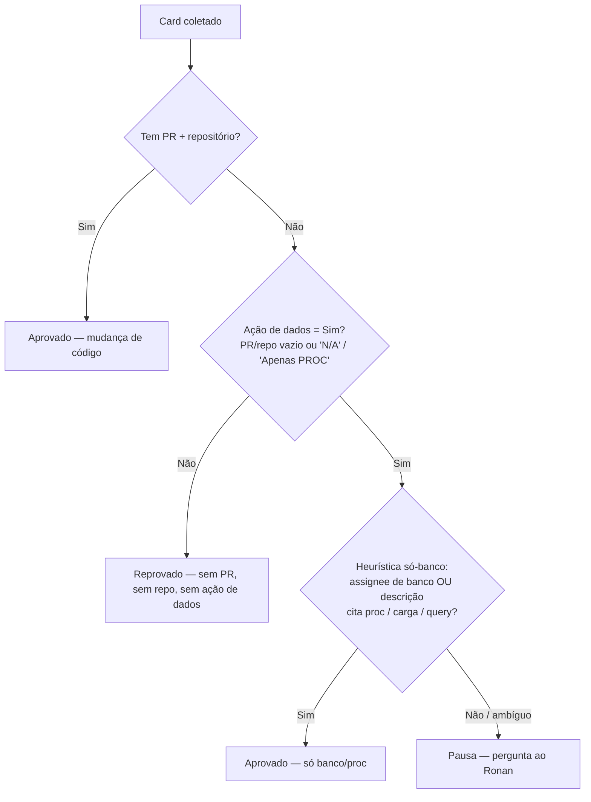

> `"N/A"` **não** conta como link. A heurística "só-banco legítimo" foi validada em produção (caso PB-5778).

---

## 8. Promoção de branches & deploy

`make run` **sempre com `target` explícito**, **nunca direto pra master**. Cada seta indica **quem faz**.

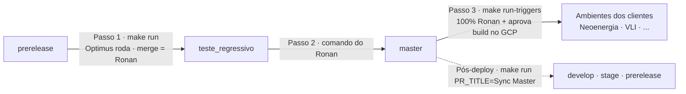

**Destaques**
- **Passo 1** o Optimus pode abrir os PRs; **o merge é sempre do Ronan** (`auto_merge=false`).
- **Passo 2 (master)** e **Passo 3 (triggers)** = **comando explícito do Ronan**; ele aprova os builds no GCP.
- Após o deploy, a master é sincronizada de volta para as branches de trabalho.

---

## 9. Governança & segurança

Da fase de Sync em diante, **toda ação que muda algo** passa por um **gate por ação**: simula primeiro,
verifica, e só executa o real com **OK explícito**.

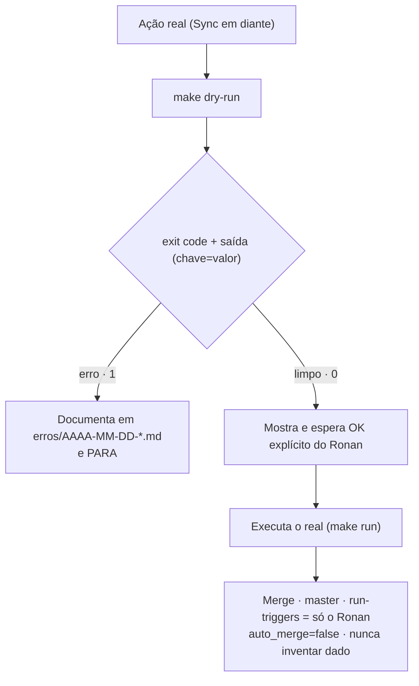

**Guardrails inquebráveis**
- **Merge, master/prod e `run-triggers` = só o Ronan.**
- **`verificar` nunca executa** — só relatório.
- **Um board por release** — nunca misturar.
- **Privilégio mínimo** · **sem segredos no repositório** · **não inventar dados ausentes**.

---

## 10. Exemplos reais

### 10.1 Ciclo E2E completo — Hotfix 1.111.2 (em produção)

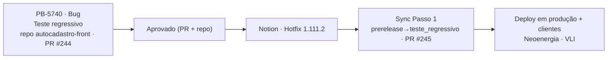

Ciclo fechado **sem erros**: coleta → validação → Notion → PR → deploy aprovado pelo Ronan. Registrado
em `execucoes/release-2026-07-16-001.json`.

### 10.2 Varredura "todos os boards" (dry-run — 2026-07-20)

Ensaio seguro (não tocou em nada), 3 blocos isolados:

| Board | Filtro | Cards | Aprovados × Reprovados |
|---|---|---|---|
| Linha de frente / incidentes | `Incidente` | 6 | 3 × 3 |
| Features | `Story` sem "Refatoração" | 7 | 5 × 2 |
| Refatoração | `Story` com "Refatoração" | 10 | 3 × 7 |

O gate por conteúdo funcionou: muitos cards de refatoração ainda sem PR/repo caíram (corretamente) em
"reprovado", virando pendência a comunicar.

---

## 11. Roadmap / evolução

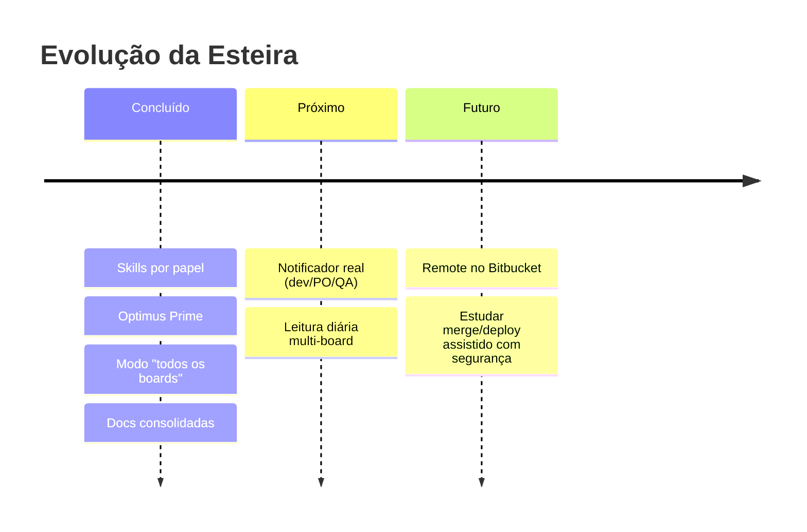

---

> **Como apresentar:** este `.md` renderiza os diagramas automaticamente no GitHub/Notion e no preview do
> VS Code/PyCharm. Para slides, exporte cada diagrama pelo [mermaid.live](https://mermaid.live) (PNG/SVG)
> ou use uma extensão de "Markdown to slides".
