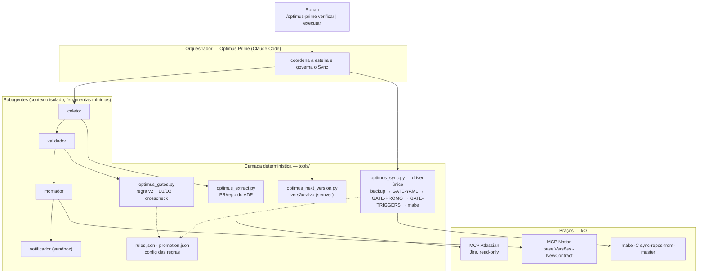
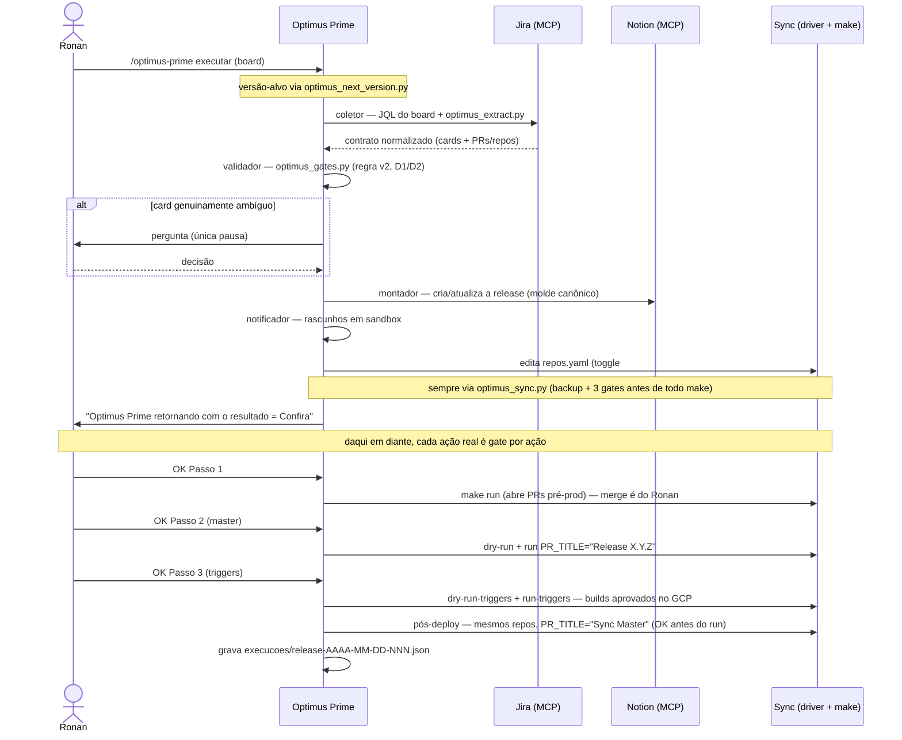
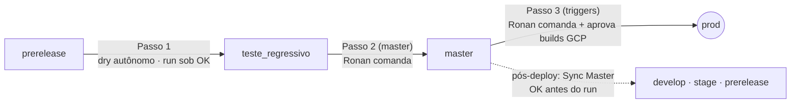
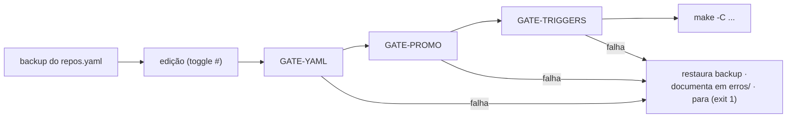

# Arquitetura — esquema visual do sistema

Diagramas Mermaid inline (renderizam no GitHub/VS Code/PyCharm sem exportar imagem) refletindo a
**arquitetura atual**: subagentes isolados + camada determinística em `tools/`.

> Comportamento canônico: [`../spec/spec.md`](../spec/spec.md) · Sequência normativa da esteira:
> [`../.claude/skills/orquestrador/SKILL.md`](../.claude/skills/orquestrador/SKILL.md) ·
> Contrato de handoff dos subagentes: [`../AGENTS.md`](../AGENTS.md) ·
> Índice dos gates: [`GATES.md`](GATES.md).
>
> Para slides/stakeholders existe a versão em imagens (histórico de julho/2026) em
> [`APRESENTACAO.md`](APRESENTACAO.md) — este arquivo é a referência técnica atualizada.

## 1. Visão em camadas

O Claude (orquestrador "Optimus Prime") coordena subagentes isolados; todo cálculo crítico é código
determinístico em `tools/` — o LLM chama o script e lê a saída, nunca decide de cabeça.

## 2. Fluxo do `executar` (board único)

Autônomo até o `make dry-run` do Sync Passo 1; a partir daí, **todo `make run`, merge, master e
triggers exigem OK explícito do Ronan**. Única pausa antes disso: card genuinamente ambíguo.

## 3. Promoção de branches (Sync)

Nunca direto pra master; `optimus_promotion_gate` bloqueia prerelease→master, self-sync e passo
divergente. Triggers só no Passo 3.

## 4. Dentro do driver do Sync (`tools/optimus_sync.py`)

Toda ação no sync passa pelo driver — nunca `make` direto nem gates soltos.

