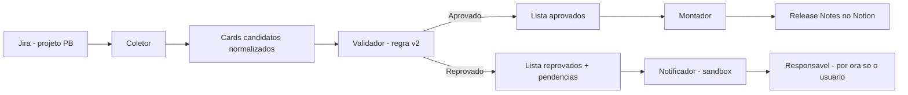

# Spec — Esteira Inteligente de Release Notes (Jira → Notion)

> Documento **vivo** (v1, 2026-07-13). Funde a spec "Esteira Inteligente para Montagem de Pacotes
> de Deploy" com o que **validamos no 1º teste E2E**. Base de origem das **skills**.
> Relacionados: `workflow-with-automation-assisted-by-management.md` (plano geral), `docs/PROPOSTA.md`,
> e o doc original `esteira-inteligente-para-montagem-de-pacotes-de-deploy.md`.
>
> **Escopo (não é só incidentes):** a esteira abrange (ou abrangerá) os boards de **incidents,
> features e refatoração**. O 1º ciclo foi validado em incidentes (PB), e daí cresce. (Por isso a
> esteira não é a "de incidentes"; a spec vive em `spec/spec.md`.)

## 1. Visão geral

Automatizar a preparação da **release notes** de deploy: coletar cards no Jira, **validar** por
conteúdo (não só status), separar **aprovados × reprovados**, registrar os aprovados no **Notion**
e **notificar** pendências dos reprovados. O deploy em si segue manual (`sync-repos-from-master`).

Quatro papéis + um orquestrador (podem ser módulos/prompts, não precisam ser 4 apps):

| Papel | Função | Estado atual |
|-------|--------|--------------|
| **Coletor** | busca cards candidatos no Jira | validado (JQL no PB) |
| **Validador** | aplica o gate de elegibilidade (regra v2) | validado |
| **Montador** | escreve/atualiza a release no Notion (molde 1.110.0) | validado |
| **Notificador** | comunica pendências dos reprovados | pendente (sandbox) |
| **Orquestrador** | coordena tudo + governa o Sync; segurança por ação, consolida, documenta erro | formalizado (skill `orquestrador` / **"Optimus Prime"**) |

## 2. Objetivo

- Somente cards **aptos por conteúdo** entram no pacote.
- Critérios aplicados de forma **consistente e configurável**.
- Release Notes **padronizada** (molde das versões anteriores).
- Responsáveis recebem **pendências** rapidamente.
- Toda decisão é **rastreável** e a execução é **idempotente**.

## 3. Decisão de arquitetura — **MCP-first**

> **Decisão #1 (recomendada):** implementar como **skill orquestrando os MCPs** (Atlassian + Notion),
> escrevendo Python **só onde o MCP não cobre** (parsear resposta grande, aplicar regra do YAML,
> consolidar o resumo). **Não** criar `jira_client.py`/`notion_client.py` próprios — isso repetiria o
> overengineering que o projeto quer evitar (`iac-platform`). Já provamos que coleta + validação +
> montagem saem 100% via MCP.
>
> O doc original sugere um serviço Python com clients dedicados; adotamos a **separação lógica** dele
> (Coletor/Validador/Montador/Notificador/Orquestrador) **sem** os clients bespoke.

## 4. Fluxo simplificado



## 5. Agentes

### 5.1 Coletor
Busca no Jira os cards candidatos e os normaliza (ver modelo em §7).
- **Entrada:** projeto(s), filtro JQL, status alvo, versão de destino.
- **Config atual:** projeto `PB`; `issuetype = Incidente`; status `Teste regressivo`, `Pronto para deploy`.
- **Um board por ciclo — NUNCA misturar:** coletar de **um** board por execução (**incidentes** *ou*
  **features** *ou* **refatoração**); o board é **parâmetro** da coleta. Cada board → sua própria
  release/hotfix. Misturar boards só com **OK explícito do usuário** ("avisaremos ao Optimus"). Hoje: incidentes/PB.
- **Registro de boards (config, não texto solto):** cada board tem projeto/issuetype/status/JQL numa
  tabela na skill `coletor` ("Configuração atual"), com **ordem = prioridade**. Mapeamento **confirmado**
  (os 3 "boards" são visões dentro do `PB`; o MCP não expõe a API de boards, então o issuetype foi
  inferido pela população em status de deploy + OK do usuário): **1º Linha de frente/incidentes = `Incidente`**
  · **2º Features = `Story`** · **3º Refatoração = `Story`** (menos importante). Status alvo iguais nos três.
- **Features × Refatoração (critério fino confirmado):** ambos são `Story`; a separação é **pelo
  título** — **Refatoração** = `summary ~ "Refatoração"` (cards `FRONT -`/`BACK -`/`Triagem -
  Refatoração ...`); **Features** = o complemento (`summary !~ "Refatoração"`). Refatoração é o 3º/menos
  importante. Card no board errado = refino do filtro (com OK do usuário) — **nunca inventar** critério.
- **Varredura "todos os boards":** o orquestrador pode varrer os três **em sequência, por prioridade**
  (incidentes 1º), rodando a esteira **isolada por board** (coleta→validação→**Notion próprio**). Isso
  **reforça** a regra "nunca misturar" (cada board = sua release/hotfix); **não** é misturar. A varredura
  **termina no Notion** — o Sync/deploy segue **por-board e em dias diferentes**. Board sem filtro → pula
  e reporta. Ver §6.1.
- **Saída:** lista de cards com chave, título, status, responsável, produto, PR, repo, ação de dados.
- **Aprendizado:** respostas do Jira são **grandes** → pedir só os campos necessários e parsear
  (salvar em arquivo + Python quando estourar o limite de tokens).

### 5.2 Validador
Aplica o **gate por conteúdo** (o status **não** garante prontidão — confirmado na prática: os 3
cards em "Pronto para deploy" estavam vazios).

**Regra de elegibilidade v2:** um card **passa** se
1. tem **PR + repositório** (mudança de código), **OU**
2. é **somente ação de banco/proc** — sem PR, identificado por **Ação de dados = Sim**
   (PR/repo vazio ou `"N/A"` / `"Apenas PROC"`).

**Barra** quem **não tem nada** (sem PR, sem repo, sem ação de dados). `"N/A"` **não** é link válido.

**Repositório derivado da PR (2026-08-19):** a URL de PR do Bitbucket identifica o repositório
(`bitbucket.org/<ws>/<repo>/pull-requests/<n>`), então o extractor deriva `repositories` das PRs —
campo Repositório vazio com PR válida **satisfaz a regra 1** (caso-modelo PB-5728: 6 PRs reprovadas
como "sem PR, sem repo"). Campo Repositório preenchido com a **própria URL da PR** é interpretado
(vira PR + repo derivado) e gera aviso não-bloqueante `repo_field_com_pr` para corrigir o card no
Jira (caso-modelo PB-6257: parse_failed falso). `parse_failed` fica reservado a link/resíduo que a
extração **não** interpretou.

**Prosseguimento da esteira (determinístico):** o campo `prosseguir` do `gates.json`
(aprovados não-vazio **e** `errors` vazio) decide seguir ao Montador ou parar. **Não há limiar
mínimo de aprovados** — 1 card aprovado é deploy válido; o orquestrador não inventa critério.

**Heurística "só-banco legítimo"** (validada 2026-07-14, caso-modelo **PB-5778** — virou deploy
real em prod): para distinguir banco legítimo de "código que esqueceu a PR" →
`Ação de dados = Sim` **e** (assignee é responsável de banco **ou** a descrição cita
proc/procedure/carga/seleção/query) → **aprova sem exigir PR/repo**. PB-5778: Ação de dados=Sim,
sem PR/repo, assignee **Alexandre Bolonhini** (banco) + descrição sobre corrigir a procedure → aprovado.

- **Saída aprovados:** chave, título, responsável, resumo, categoria, evidências, data da validação.
- **Saída reprovados:** chave, título, responsável, `pending_items`, orientação, data.
- **Refino aberto:** ler PR do **painel Development** quando o campo estiver vazio.

### 5.3 Montador
Cria/atualiza a página da versão no Notion, no **molde 1.110.0**.
- **Tabela única:** `Item · Pull Requests · Tem Ação de Banco ? · Tem Ação de Infra ? · Merge Realizado ?`
  - **Item:** card como link **com título** e status (ex.: `[PB-5415 — <título>](.../browse/PB-5415) · <status>`).
    O *mention* nativo do Jira não é reproduzível via MCP; o link enriquecido é o equivalente suportado.
  - **Pull Requests:** URL da PR (código) ou `• APENAS PROC` (banco).
  - **Infra / Merge / nome do proc:** em branco até apurarmos (o agente **não inventa**).
- **Blocos:** Testes regressivos · Ambientes · Repositórios para Deploy · Participantes do Deploy
  (Dados: Alexandre Rudoi · QA: Dorgival Silva Filho · DevOps/Resp.: Ronan Berto / Yuri Stolai · sobreaviso: assignees).
- **Categorias possíveis (evolução):** correção · banco de dados · infraestrutura · melhoria ·
  alteração técnica · procedimento pós-deploy.
- **Idempotência:** não duplicar card; se a página da versão já existe, **atualizar** (usamos `replace_content`).
- **Verificação:** reler a página após escrever (já praticado).

### 5.4 Notificador
Comunica pendências dos reprovados. **Guardrail:** **sandbox** — só o usuário por enquanto; **sem**
pingar Alexandre/Yuri sem ok explícito.
- **Canais possíveis:** Teams · e-mail · comentário no card · Notion. **Atenção:** o token do Jira
  hoje é **read-only** (`read:jira-work`) → comentar no card exigiria ampliar escopo.
- **Idempotente:** não renotificar o mesmo evento sem nova análise.
- **Registro:** card, responsável, pendências, canal, data/hora, status do envio.

## 6. Orquestração

```mermaid
sequenceDiagram
    actor R as Usuario (aprova)
    participant O as Orquestrador
    participant J as Atlassian MCP (read-only)
    participant V as Validador
    participant M as Montador
    participant N as Notion MCP
    participant T as Notificador (sandbox)

    R->>O: iniciar esteira (autonomo ate o Sync Passo 1)
    O->>O: versao-alvo automatica (Release X.(Y+1).0)
    O->>J: coletar (JQL: PB, Incidente, status alvo)
    J-->>O: cards + campos
    O->>V: validar por conteudo (regra v2)
    V-->>O: aprovados + reprovados (com pending_items)
    opt card genuinamente ambiguo
        V-->>O: blocked + evidencias
        O->>O: documenta erro e encerra sem pedir autorizacao
    end
    alt existem aprovados
        O->>M: montar release (sem pedir OK)
        M->>N: create/replace pagina da versao
        N-->>M: page_id + url
        M->>N: fetch (verificacao)
        N-->>M: conteudo renderizado
        M-->>O: release atualizada
    end
    alt existem reprovados
        O->>T: notificar pendencias (so usuario)
        T-->>O: registro das notificacoes
    end
    O->>R: resumo consolidado (execucao)
    Note over R,N: Passo 1 do Sync roda no executar de board unico; master/triggers sob OK do usuario
```

> **Coleta paralelizável (fan-out):** acima do limiar de `tools/workers.json`, a coleta é dividida
> em lotes executados por workers efêmeros `coletor-card`, despachados pelo orquestrador (subagente
> nunca invoca subagente), com agregação determinística equivalente ao monolítico
> (`tools/optimus_card_aggregate.py`, fail-closed). A validação (regra v2, D1/D2) nunca é
> fragmentada — roda sempre sobre o contrato agregado completo.

### 6.1 Optimus Prime (orquestrador) — modos, gates e o Sync

O orquestrador é a skill **"Optimus Prime"** (`.claude/skills/orquestrador/`). Ele **governa as
skills e o `sync-repos-from-master`**, com **um comando único** e dois modos:

- **`verificar`** — dry/seguro: leitura real, escrita zero (coletor e validador rodam read-only →
  confere → montador **simula** o Notion → o alvo do Sync é só **reportado**, sem editar
  `repos.yaml` nem rodar `make`). Só relatório.
- **`executar`** (board único) — roda a esteira **autônoma até o `make dry-run` do Sync Passo 1**
  (versão-alvo automática → coletor → validador → montador cria a página **sem pedir OK** → edita o
  `repos.yaml` → `make dry-run`); ao terminar (dry-run limpo) emite a **mensagem única `Confira`** e
  **para**. Não há microaprovações antes disso; card ambíguo/erro bloqueia, documenta e encerra sem
  pedir autorização para contornar. **O `make run` do Passo 1** (abre os
  PRs pré-prod), merge, **master (Passo 2)** e **triggers (Passo 3)** seguem **sob comando explícito do
  usuário** (com gate de segurança por ação). No alvo `todos os boards`, a varredura **termina no Notion**.
  **Versão-alvo:** `Release` sequencial por board (`X.(Y+1).0`) — **incidente não é hotfix por padrão**;
  hotfix só quando o usuário avisar.

**Alvo (independente do modo):** **`<board>`** (um board, padrão) ou **`todos os boards`** — varre os
três **em sequência, por prioridade (incidentes 1º)**, **isolados** (cada board → sua própria página no
Notion; nunca misturar). No alvo `todos os boards` a varredura **termina no Notion**; o Sync fica
**por-board e explícito** (fora do loop). Board sem filtro definido → **pula e reporta** "a definir".
Gatilhos: `Optimus Prime verificar todos os boards` / `Optimus Prime iniciar todos os boards`.

**Gates automáticos por passo (asserções duras — qualquer falha documenta em `erros/` e para):**
- **GATE-VER-1 / GATE-VER-2 (Passo 1 — versão-alvo):** calcular a próxima versão pelo **maior número
  semântico**, nunca por data; verificar que **não colide com página existente**. Impede reubo/fora-de-ordem.
- **GATE-ADF (Passo 2 — coletor):** extrair URLs de PR/repo como **ADF estruturado**, não string;
  marcar `parse_failed: true` só quando o campo tem **link** (URL/inlineCard ou resíduo `[Card]`) e a
  extração zerou. Texto puro sem URL ("APENAS PROC", "N/A") = `sem_link`, com o texto preservado.
- **GATE-FALSO-VAZIO (Passo 3 — validador):** **nunca reprovar** card com `parse_failed: true` ou ADF
  cru não-vazio; devolver ao coletor ou escalar.
- **GATE-CONJUNTO (Passo 4 — montador):** **antes de escrever**, reconciliar: o conjunto de cards a
  montar **deve ser idêntico** aos aprovados do validador (mesmas chaves, mesma contagem). Nenhum card
  "passa" sem ter saído do gate.
- **GATE-MOLDE (Passo 4 — montador):** no re-fetch final, **colunas + blocos devem bater com a última
  página do mesmo Tipo**. Restaura o critério de fidelidade ao padrão.
- **GATE-LINKS (Passo 4 — montador):** no re-fetch, **nenhuma célula vazia onde o card tem link**. Pega
  o sintoma de links perdidos.
- **GATE-IDEMPOT (Passo 4 — montador):** se página já existe, **atualizar** (use `notion-update-page`),
  nunca criar outra.
- **GATE-YAML (edição do `repos.yaml`) + Sync inviolável:** cwd SEMPRE no workflow; NUNCA `cd` no sync.
  Acionar o sync só por `make -C "$SYNC_REPO_PATH" <alvo>` e editar só `"$SYNC_REPO_PATH/repos.yaml"`
  (toggle de `#`; a única linha de conteúdo que muda por passo é o escalar `defaults.source`). Backup no
  workflow (`execucoes/repos.yaml.optimus-bak`) antes; após editar,
  `tools/optimus_yaml_gate.py execucoes/repos.yaml.optimus-bak "$SYNC_REPO_PATH/repos.yaml"` deve
  retornar exit 0. Exit 1 → restaura o backup, documenta em `erros/` (no workflow) e para. Backup/erros/
  execucoes nunca dentro do sync; `.env`/`credentials/` do sync intocáveis.
- **GATE-PROMO (promoção de branch — inquebrável, "nunca direto pra master"):** antes de **QUALQUER**
  `make dry-run`/`make run`/triggers, rodar
  `tools/optimus_promotion_gate.py "$SYNC_REPO_PATH/repos.yaml" --step <passo1|passo2|pos-deploy>`.
  O gate lê o `source`→`targets` **efetivos** (linhas não comentadas) e só aprova pares da whitelist
  (`tools/promotion.json`): Passo 1 `prerelease→teste_regressivo`, Passo 2 `teste_regressivo→master`,
  pós-deploy `master→develop/stage/prerelease`. **Bloqueia** `master` vindo de fonte ≠ `teste_regressivo`
  (ex.: `prerelease→master` — causa-raiz do incidente 2026-08-04), self-sync, branch desconhecida e
  divergência entre o passo declarado e o que o YAML expressa. Exit 1 → **não roda o `make`**, documenta
  em `erros/` e para.

**Gate de segurança por ação:** toda ação do `sync-repos-from-master` roda antes em **dry-run**, parseia
a saída (`chave=valor`) + **exit code** (0 ok / 1 erro); se erro → **documenta e para**. **Todo `make run`
(Passo 1 e Passo 2) e as triggers (Passo 3):** se limpo → **mostra e espera comando explícito** do usuário
antes do real. O `make dry-run` e a edição do `repos.yaml` são autônomos.

**Governança do `repos.yaml` (guiada pela documentação):** lê o **doc da versão no Notion** e
**descomenta (no arquivo já existente, formato catálogo) apenas as linhas `name`+`repository`** dos
repositórios de "Repositórios para Deploy"; mantenha `triggers:` comentados; **o que não corresponder →
comenta de volta** (não entra no `make run`). **NUNCA reescreva/reformate/reordene/gere o arquivo nem
altere `defaults`/`cloud_build`/valores; NUNCA adicione/remova linhas ou anotações.** Só alterne o `#`.
**Passa pelo gate `tools/optimus_yaml_gate.py`** (exit 1 → restaura backup e para). **Repo faltando →
para e reporta** (usuário adiciona).

**Fluxo de promoção de branches (nunca direto pra master; `make run` sempre com `target` explícito):**
- **Passo 1** — `source: prerelease` → `target: teste_regressivo` (pré-prod): edita o YAML e roda
  `make dry-run` (autônomo); **o `make run` (abre os PRs) é sob OK explícito do usuário**, depois da
  mensagem `Confira`. Merge é do usuário.
- **Passo 2** — `source: teste_regressivo` → `target: master` (prod): **só sob comando/override do usuário**;
  por padrão o Optimus Prime edita o YAML + `make dry-run`, e roda o `make run` de master só sob override.
- **Passo 3** — `make run-triggers` (ambientes dos clientes; **não recebe `PR_TITLE`**): **100% do usuário**,
  após OK do QA (aprovação do build no GCP é dele).
- Troca de `source`/`target` por passo é via **edição do YAML** (comentar/descomentar). Branches:
  `prerelease` → `teste_regressivo` → `master` (confirmar grafia exata antes do run real).

**Mensagem única de retorno (contrato de confiança):** no `executar`, ao concluir **todo o escopo
autônomo** (cards conferidos → Notion com **TODOS** os links reais → `repos.yaml` editado → `make dry-run`
do Passo 1 limpo), o Optimus emite **exatamente uma** mensagem de fechamento, começando pela linha exata
`Optimus Prime retornando com o resultado = Confira`, seguida (na mesma mensagem) dos artefatos para
conferência (URL do Notion, repos ativados no YAML, resultado do `dry-run`). Execução **silenciosa** pelo
caminho (sem "posso avançar?"); card ambíguo e erros interrompem com bloqueio objetivo, nunca com
pedido de autorização intermediária. **O `make run` do Passo 1** (abre os
PRs pré-prod) só roda **depois**, sob OK explícito do usuário. No alvo `todos os boards`, a mensagem sai
**por board** (fim no Notion). `verificar` **não** emite essa linha. O usuário confia na conferência do
Optimus e **confere depois**.

**Diretrizes inquebráveis:** **merge é só do usuário** (manter `auto_merge=false`); **master (Passo 2),
deploy real (`make run-triggers`) e aprovação de build no GCP = do usuário**; **hotfix** o usuário conduz.
Erros viram **`erros/AAAA-MM-DD-*.md`** (base de refino, corrigido só com OK do usuário).

## 7. Modelo de card normalizado

Contrato comum entre os agentes. **Nota:** a versão de destino **não** vem do card — é atribuída na
montagem do pacote; por isso fica no resumo de execução (§9), não no card.

> **Multi-link (fidelidade ao dado real):** `repositories` e `pull_requests` são **arrays** — um card
> pode ter **mais de um repositório** e **mais de uma PR/merge**. Capturar **TODOS** os links reais do
> card, nunca só o primeiro; deduplicar quando a PR/repo é compartilhada entre irmãos do mesmo épico;
> **nunca inventar** e **nunca omitir**.

```json
{
  "card_id": "PB-5415",
  "title": "Reaproveitamento automático reenvia documentos já aprovados",
  "issue_type": "Incidente",
  "status": "Teste regressivo",
  "owner": { "name": "Weverton Ferreira", "account_id": "..." },
  "product": "NewContract",
  "epic": { "key": "PB-5159", "summary": "Melhorias na Tela de Análise" },
  "summary": "...",
  "category": "correcao",
  "links": {
    "jira": "https://bernhoeft.atlassian.net/browse/PB-5415",
    "repositories": ["https://bitbucket.org/bernhoeft/contractweb-v3"],
    "pull_requests": [{"label": "contractweb-v3 #5164", "url": "https://bitbucket.org/bernhoeft/contractweb-v3/pull-requests/5164"}]
  },
  "parse_status": {
    "parse_failed": false,
    "pr_url_count": 1,
    "repo_url_count": 1,
    "pr_sem_link": false,
    "repo_sem_link": false,
    "pr_field_text": "",
    "repo_field_text": ""
  },
  "deploy_fields": {
    "acao_dados": "Nao",
    "acao_infra": null,
    "merge_realizado": null,
    "apenas_proc": false,
    "proc_name": null
  },
  "validation": {
    "result": "approved",
    "reason": "tem PR + repositorio",
    "checked_at": "2026-07-13T11:00:00-03:00",
    "pending_items": []
  }
}
```

**Novos campos (correção da causa-raiz A, ADF/links perdidos):**
- **`epic`:** chave + resumo do épico (parent) — permite detectar cards irmãos com mesma PR/repo
  (deduplicação via D1/D2) e sinalizar quando irmãos ficam fora (possível dependência).
- **`parse_status`:** registra se a extração de PR/repo (customfield_12400/12399 em ADF) saiu com
  sucesso ou falhou:
  - `parse_failed: true` → o campo tinha **link** (URL/inlineCard, ou resíduo renderizado tipo
    `[Card]`) mas a extração zerou (falha real; re-extrair). Texto puro sem nenhuma URL
    ("APENAS PROC", "N/A", "não tem") **não** é falha — é `sem_link`.
  - `pr_sem_link` / `repo_sem_link` → o campo tem só texto, sem URL alguma (placeholder legítimo;
    pode ser card só-banco/dados **ou não** — a ação de dados não implica ausência de PR: os campos
    de PR/repo são sempre a fonte).
  - `pr_field_text` / `repo_field_text` → texto literal do campo, preservado para ser reescrito no
    Notion **como está**.
  - `pr_url_count` / `repo_url_count` → contagem de URLs extraídas (para debug/auditoria).
  - Invariante (GATE-CROSSCHECK): `apenas_proc` **nunca** com `pr_url_count`/`repo_url_count` > 0.

## 8. Mapeamento de dados

### 8.1 Jira (leitura — escopo `read:jira-work`)
- **Site / cloudId:** `bernhoeft.atlassian.net` / `f36e5519-1f88-4f71-a406-75326e86deda`.
- **Projeto:** `PB` · **Issue type:** `Incidente` · **Status alvo:** `Teste regressivo`, `Pronto para deploy`.

| Info | Campo | ID |
|------|-------|-----|
| Link da PR | Links das PR's | `customfield_12400` |
| Link do repositório | Links do repositório | `customfield_12399` |
| Ação de dados | Ação de dados para deploy (Sim/Não) | `customfield_12297` |
| Merge realizado | Merge realizado? | `customfield_12401` |
| Produto | Produto | `customfield_11993` |
| Ação de infra | **não existe ainda** (a criar) | — |

> **Os campos de PR (`customfield_12400`) e de repositório (`customfield_12399`) podem trazer mais de um
> link** — o coletor extrai **todos** (arrays `pull_requests` / `repositories` do §7), nunca só o primeiro.

### 8.2 Notion (leitura + escrita)
- **Database "Versões - NewContract":** data_source `23e19d89-2318-81ff-812d-000b6afb6b5a`;
  props: **Versão** (title), **Tipo** (select: Release / Hotfix).
- **Molde de conteúdo:** página `1.110.0`. **Base "notes" de teste:** `1.111.0 (teste)`.

## 9. Resumo consolidado da execução

```json
{
  "execution_id": "release-2026-07-13-001",
  "release_version": "1.111.0",
  "started_at": "2026-07-13T11:00:00-03:00",
  "finished_at": "2026-07-13T11:07:00-03:00",
  "cards_collected": 11,
  "cards_approved": 8,
  "cards_rejected": 3,
  "release_notes_updated": true,
  "notifications_sent": 0,
  "errors": []
}
```

## 10. Regra de validação como config (`tools/rules.json`)

A regra v2 é externalizada em **`tools/rules.json`** (fonte única, consumida por
`tools/optimus_gates.py`): mudar a regra = editar o JSON, nunca o código nem as skills.
Campos: `valores_invalidos_como_vazio` (strings que não contam como link),
`epicos_all_or_nothing` (D1 forçado) e `db_owners` (heurística só-banco legítimo).
Documentação de cada valor no campo `_doc` do próprio arquivo. A matriz de promoção de
branches segue o mesmo padrão em `tools/promotion.json` (GATE-PROMO).

## 11. Regras gerais

- **Rastreabilidade:** cada decisão registra agente, data/hora, card, critérios, resultado, justificativa, evidências.
- **Idempotência:** não duplicar cards na release, não renotificar sem nova análise, não gerar duas versões do mesmo pacote.
- **Exceções:** critérios inconclusivos, dados contraditórios ou evidências insuficientes falham
  fechado e são documentados para revisão posterior. **O agente não inventa dados nem pede autorização
  intermediária para preencher campo ausente.**
- **Segurança (privilégio mínimo):** Jira leitura (`read:jira-work`); Notion só a base de Release Notes; notificação com permissão restrita; repositório leitura.
- **Regra do projeto:** no `executar` de board único, a esteira é **autônoma até o `make dry-run` do Sync
  Passo 1** (inclui criar a doc no Notion, editar o `repos.yaml` e rodar o `make dry-run`), terminando na
  mensagem `Confira`. OK **explícito do usuário** fica reservado ao **`make run` (Passo 1 e Passo 2)**,
  **Merge** e **Triggers (Passo 3)**. Card genuinamente ambíguo bloqueia e documenta; não vira gate de
  autorização. Todo o restante roda sem aprovação humana.
- **Desempenho & custo:** **coleta enxuta** (só os campos necessários, sem `description` em lote — puxar
  sob demanda); no Notion, localizar via `query_data_sources` (SQL) e **verificar uma vez ao final**;
  **rodar no modelo mais barato por padrão**; ambiguidade falha fechado e é registrada. **Nunca**
  sacrificar o funcionamento por economia — na dúvida, mantém como está.

## 12. Escopo da 1ª versão × evoluções

**1ª versão (foco):** execução manual · coleta em um projeto · checklist fixo (v2) · listas aprovados/reprovados · atualização de uma página no Notion · geração das mensagens de pendência · registro da execução. Notificação automática **só** depois de definir o canal oficial.

**Evoluções:** execução agendada / disparada por mudança de status · integração Bitbucket/GitHub (validar PR, checar merge, painel Development) · categorias na release · revalidação de cards corrigidos · painel de acompanhamento · agentes independentes.

## 13. Backlog de refino (imediato)

- [ ] **Nome do proc** dos cards só-banco (ler descrição).
- [ ] **Ação de Infra** — criar campo no Jira e mapear.
- [ ] **Merge realizado** — vazio nos cards; definir origem (talvez painel Development).
- [ ] **PR no painel Development** quando o campo estiver vazio (pode destravar "Pronto para deploy").
- [ ] Checkboxes de **Testes regressivos** / **Ambientes** — definir origem.
- [ ] Decidir: release mistura "em teste" e "pronto p/ deploy" ou separa?
- [ ] Definir **canal** do Notificador e ampliar escopo do Jira **se** for comentar no card.
- [ ] Cravar o **template do Montador** (o que preencher / deixar em branco) pra não iterar layout.
